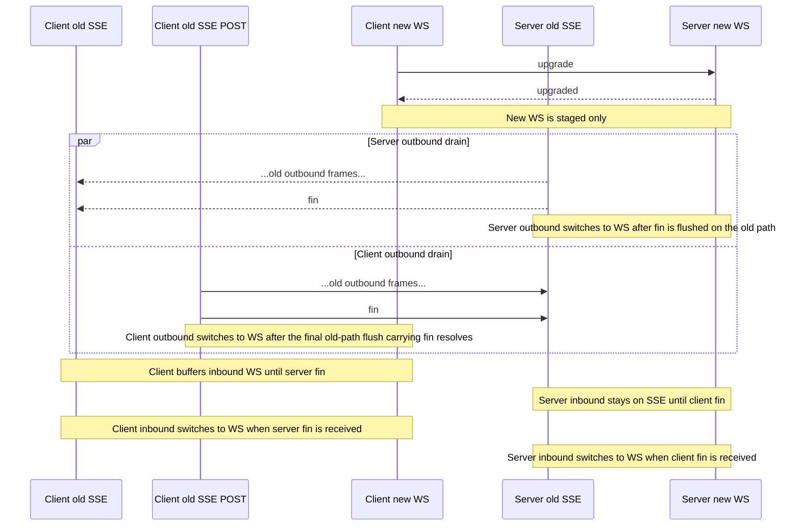

# Seamless Channel Upgrade Protocol

This document describes the SSE -> WS channel upgrade protocol implemented by the wire protocol.

It is intended for maintainers.

## Goal

Upgrade without dropping channel traffic by treating the two directions independently:

- Server -> client traffic upgrades independently from client -> server traffic.
- Client -> server traffic upgrades independently from server -> client traffic.
- Server memory must stay bounded.
- Client may buffer temporarily during overlap.

That asymmetry is the core design choice.

## Mental Model

There are two half-duplex paths:

- Outbound from the server to the client
- Outbound from the client to the server

During upgrade, each side stops using the old transport for one direction at a different time.

`fin` is directional:

- Server -> client `fin` means: no more server -> client frames will be sent on the old transport.
- Client -> server `fin` means: no more client -> server frames will be sent on the old transport.

## Control Frames

### `upgrade`

Sent by the client on the new transport.

Meaning:

- "Please stage this transport as a candidate for takeover."

### `upgraded`

Sent by the server on the new transport.

Meaning:

- "The new transport is staged and bound to the session."
- It does **not** mean both directions have switched.
- It means both sides may now start draining their own old outbound direction toward a directional `fin`.

### `fin`

Directional handoff marker.

Meaning depends on direction:

- Server -> client `fin`: old inbound path to the client is closed.
- Client -> server `fin`: old inbound path to the server is closed.

## Upgrade Sequence

### High-level sequence

1. Client opens WS.
2. Client sends `upgrade` on WS.
3. Server stages the WS path.
4. Server sends `upgraded` on WS.
5. Server flushes old outbound ordering on SSE and moves toward server -> client `fin`.
6. Client receives `upgraded` on WS and simultaneously flushes old outbound ordering on SSE POST toward client -> server `fin`.
7. Once server `fin` is flushed on the old outbound path, server switches outbound to WS.
8. Once the client's final old-path flush carrying client `fin` resolves, client switches outbound to WS.
9. Client receives server `fin` on SSE and activates inbound WS immediately.
10. Server receives client `fin` on SSE and activates inbound WS immediately.
11. Old SSE path closes once neither direction needs it.

### Why this ordering exists

If either side waited for the peer to finish first, the overlap would serialize and the asymmetric design would lose most of its benefit.

Instead, both sides drain their own old outbound direction as soon as the new transport is staged:

- the server drains old server -> client frames toward server `fin`
- the client drains old client -> server frames toward client `fin`

The client buffers the staged inbound direction until server `fin` arrives:

- client buffers inbound WS frames until server `fin`

The server does not buffer staged inbound WS frames. Instead, client outbound stays gated on the old transport until the final old-path flush carrying client `fin` resolves.

## Direction Ownership During Overlap

During overlap, ownership is split:

- Server outbound owner: old SSE until server `fin` is flushed on the old send path, then WS
- Server inbound owner: old SSE until client `fin` is received, then WS
- Client inbound owner: old SSE until server `fin` is received, then WS
- Client outbound owner: old SSE until client has drained old outbound and the final old-path flush carrying client `fin` resolves, then WS

This split is what makes the upgrade seamless.

The important point is that the two outbound drains run concurrently.

## Client State Machine

### Before `upgraded`

- Active transport is SSE.
- Candidate transport is WS.
- Client sends nothing on WS except upgrade control traffic.

### After `upgraded`, before server `fin`

- WS is staged, not fully active.
- Client buffers inbound WS frames.
- Client begins draining old outbound on SSE toward client `fin`.
- New client sends are buffered until the client outbound cutover completes.

### After client outbound drain + final `fin` flush resolve

- Client promotes outbound to WS.
- Client may now send application frames on WS.
- Client may still buffer inbound WS frames until server `fin` arrives.

### After server `fin`

- Client stops expecting more inbound on SSE.
- Client drains buffered inbound WS frames synchronously.
- If client outbound already moved, the old transport is now inbound-only and can retire.

## Server State Machine

### After `upgrade`

- New WS connection is bound to the session.
- Server keeps inbound ownership on the old connection.
- Server schedules old-path `fin` on the current outbound connection.
- Server ignores application frames arriving on staged WS before client `fin`.

### After server `fin` is flushed on the old send path

- Server promotes outbound ownership to WS.
- Server still keeps inbound ownership on the old connection.

### After client `fin`

- Server promotes inbound ownership to WS.
- Old connection can now close without affecting the session.

## Sequence Diagram

## Invariants

- Server must never accept application frames from the new transport before client `fin`.
- Client must never send application frames on the new transport before its old outbound drain is complete.
- Client may buffer inbound new-path frames.
- Client outbound may remain gated until the final old-path flush carrying client `fin` resolves.

## Important Files

- `packages/telefunc/wire-protocol/shared-ws.ts`
- `packages/telefunc/wire-protocol/client/connection.ts`
- `packages/telefunc/wire-protocol/server/connection.ts`
- `packages/telefunc/wire-protocol/server/sse.ts`
- `packages/telefunc/wire-protocol/server/ws.ts`

## Common Misreadings

### `upgraded` means fully switched

Wrong.

It only means the new transport is staged and can participate in the overlap.

### `fin` is symmetric

Wrong.

`fin` is directional and each direction upgrades independently.

### Recovery and upgrade are the same thing

Wrong.

Recovery uses `reconcile` / `reconciled`.
Upgrade uses `upgrade` / `upgraded` / `fin`.
